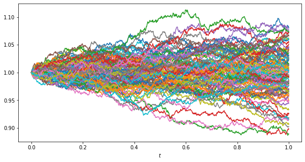

# Price process generator

This library provides various generators of stochastic processes modelling real price processes. The generated synthetic
price data can be used in Monte Carlo simulations (or similar statistical experiments) and potentially even to train ML
algorithms. 

Currently the implemented generators are

- [Geometric Wiener motion](https://en.wikipedia.org/wiki/Geometric_Brownian_motion)
- [Geometric Lévy flights](https://en.wikipedia.org/wiki/L%C3%A9vy_process)
- [Ising](https://borab96.github.io/IsingPriceDynamics/ising.html)

## Installation

``pip install price_process``

## Usage and documentation

### Basic

The standard model of stochastic price dynamics is the SDE


with solution the *geometric Brownian motion*


In order to get, say 10 samples of a 1000 point process, one would run

````
from price_process.process import *
Gaussian([1000, 10]).to_geometric(0, 0.04).plot()
````


### Custom generator

Custom generators can be implemented by subclassing

